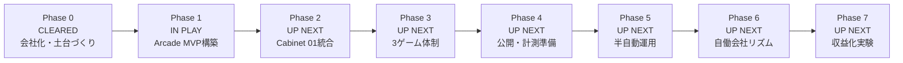

# Roadmap

Codex Arcade uses phases to keep the project understandable.

The goal is to grow from a planning folder into an AI-agent-operated arcade studio.

```txt
Current Roadmap Version: v0.6
Last Updated: 2026-05-14
```

For major roadmap changes, see `docs/roadmap-history.md`.

## How To Read This Roadmap

```txt
Roadmap Board
= 全体像を見る場所

Phase Board
= 特定フェーズの中身を見る場所

Current Board
= 今のフェーズだけを見る場所
```

## Roadmap Board

This board shows the whole project at a glance.



## Phase Summary

| Phase | Status | Sprint Progress | Next Focus |
| --- | --- | ---: | --- |
| Phase 0: 会社化・土台づくり | CLEARED | 4/4 | Done |
| Phase 1: Arcade MVP構築 | IN PLAY | 2/3 | MVP実装 |
| Phase 2: Cabinet 01統合 | UP NEXT | 0/3 | 移植計画 |
| Phase 3: 3ゲーム体制 | UP NEXT | 0/3 | Metro Mender |
| Phase 4: 公開・計測準備 | UP NEXT | 0/3 | 公開準備 |
| Phase 5: 半自動運用 | UP NEXT | 0/3 | Agentフロー試運転 |
| Phase 6: 自働会社リズム | UP NEXT | 0/3 | 週次レビュー |
| Phase 7: 収益化実験 | UP NEXT | 0/3 | 収益化リサーチ |

## Current Board

This board shows only the current phase.

```txt
Phase 1: Arcade MVP構築

CLEARED
- Sprint 1/3: Arcade MVP設計

IN PLAY
- Sprint 2/3: Arcade MVP実装
- Marketing/Creative: ゲーセン感の再設計

UP NEXT
- Sprint 3/3: ローカルQAと調整
```

## Status Key

```txt
CLEARED
Finished.

IN PLAY
Currently active. Multiple workstreams may be active at the same time.

UP NEXT
Not active yet, but planned.
```

## Phase Boards

## Phase 0 Board: 会社化・土台づくり

Status: CLEARED

Purpose:

```txt
AIエージェント会社として動く準備をする。
```

CLEARED:

- Sprint 1/4: 本部フォルダとGitHub
- Sprint 2/4: 会社モデルと部署
- Sprint 3/4: 進行管理の仕組み
- Sprint 4/4: Phase 1準備確認

## Phase 1 Board: Arcade MVP構築

Status: IN PLAY

Purpose:

```txt
親サイトとして最低限動くCodex Arcadeを作る。
```

IN PLAY:

- Sprint 2/3: Arcade MVP実装
- Marketing/Creative: ゲーセン感の再設計

CLEARED:

- Sprint 1/3: Arcade MVP設計

UP NEXT:

- Sprint 3/3: ローカルQAと調整

## Phase 2 Board: Cabinet 01統合

Status: UP NEXT

Purpose:

```txt
Neon Core Survivorを最初の実ゲームとして統合する。
```

UP NEXT:

- Sprint 1/3: 移植計画
- Sprint 2/3: ゲームファイル移植
- Sprint 3/3: QAとサムネイル

## Phase 3 Board: 3ゲーム体制

Status: UP NEXT

Purpose:

```txt
3つのゲームが並ぶArcadeにする。
```

UP NEXT:

- Sprint 1/3: Metro Mender
- Sprint 2/3: Specimen Night Shift
- Sprint 3/3: 3ゲームQA

## Phase 4 Board: 公開・計測準備

Status: UP NEXT

Purpose:

```txt
人に見せられる公開版にする。
```

UP NEXT:

- Sprint 1/3: 公開準備
- Sprint 2/3: GitHub Pages
- Sprint 3/3: 公開文言と安全確認

## Phase 5 Board: 半自動運用

Status: UP NEXT

Purpose:

```txt
Codex部署を使って制作、QA、登録、告知を回す。
```

UP NEXT:

- Sprint 1/3: Agentフロー試運転
- Sprint 2/3: 新作追加試運転
- Sprint 3/3: リリースループ試運転

## Phase 6 Board: 自働会社リズム

Status: UP NEXT

Purpose:

```txt
AI会社っぽく定期提案、分析、改善を回す。
```

UP NEXT:

- Sprint 1/3: 週次レビュー
- Sprint 2/3: 分析/マーケレポート
- Sprint 3/3: 改善バックログ運用

## Phase 7 Board: 収益化実験

Status: UP NEXT

Purpose:

```txt
体験を壊さない収益化を小さく試す。
```

UP NEXT:

- Sprint 1/3: 収益化リサーチ
- Sprint 2/3: 低リスク実験案
- Sprint 3/3: Policy & Safety確認
