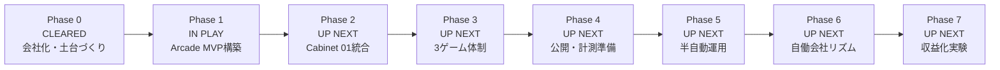

# Roadmap

Codex Arcade uses phases to keep the project understandable.

The goal is to grow from a planning folder into an AI-agent-operated arcade studio.

## Roadmap Board

This is the first place to look when asking "where are we now?"

The project moves from left to right.



## Current Board

```txt
Current Position
Phase 1 Sprint 1/3 - Arcade MVP Design

CLEARED
- Phase 0 Sprint 1/4: 本部フォルダとGitHub
- Phase 0 Sprint 2/4: 会社モデルと部署
- Phase 0 Sprint 3/4: 進行管理の仕組み
- Phase 0 Sprint 4/4: Phase 1準備確認

IN PLAY
- Phase 1 Sprint 1/3: Arcade MVP設計

UP NEXT
- Phase 1 Sprint 2/3: Arcade MVP実装
- Phase 1 Sprint 3/3: ローカルQAと調整
```

## Phase Overview

| Phase | Status | Purpose | Main Sprints |
| --- | --- | --- | --- |
| Phase 0: Company Foundation | CLEARED | 会社の土台づくり | 本部/GitHub, 会社モデル, 進行管理, Phase 1準備 |
| Phase 1: Arcade MVP | IN PLAY | 親Arcadeサイトを作る | MVP設計, MVP実装, ローカルQA |
| Phase 2: Cabinet 01 Integration | UP NEXT | Neon Core Survivorを統合 | 移植計画, ゲーム移植, QA/サムネイル |
| Phase 3: Three-Cabinet Arcade | UP NEXT | 3ゲーム体制にする | Metro Mender, Specimen Night Shift, 3ゲームQA |
| Phase 4: Public Release Prep | UP NEXT | 人に見せられる形にする | 公開準備, GitHub Pages, 文言/安全確認 |
| Phase 5: Semi-Automated Operation | UP NEXT | 半自動で追加運用する | Agentフロー試運転, 新作追加試運転, リリースループ |
| Phase 6: Agent Company Rhythm | UP NEXT | AI会社っぽく定期運用する | 週次レビュー, 分析/マーケレポート, 改善バックログ |
| Phase 7: Monetization Experiments | UP NEXT | 収益化を小さく検討する | 収益化リサーチ, 低リスク実験案, Policy & Safety確認 |

## Status Key

```txt
CLEARED
Finished.

IN PLAY
Currently active. Multiple workstreams may be active at the same time.

UP NEXT
Not active yet, but planned.
```

## Phase 0: Company Foundation

Status: cleared

Purpose:

```txt
Create the foundation for Codex Arcade as an AI-agent-operated company.
```

Scope:

- Project rules
- GitHub setup
- Initial cabinet concepts
- Company model
- Department agents
- Marketing and analytics direction
- Monetization direction
- Scheduling

Done when:

- Core documents exist.
- Initial Cabinet 01/02/03 order is recorded.
- GitHub repository is connected.
- Next build phase is clear.

Progress board:

```txt
CLEARED
- Headquarters setup
- GitHub connection
- Initial cabinet lineup
- Company model
- Marketing and analytics direction
- Monetization department
- Scheduling docs
- Phase 1 readiness check

IN PLAY
- Phase 1 Sprint 1/3 - Arcade MVP Design

UP NEXT
- Phase 1 Sprint 2/3 - Arcade MVP Implementation
```

## Phase 1: Arcade MVP

Status: in play

Purpose:

```txt
Build the parent Codex Arcade web app.
```

Scope:

- `index.html`
- `styles.css`
- `arcade.js`
- `games.json`
- Game card layout
- Credit display
- INSERT COIN flow
- Game launch links

Done when:

- The arcade opens locally in a browser.
- Game cards can be rendered from a manifest.
- The site is ready to register the first game.

Planned sprints:

```txt
Phase 1 Sprint 1/3: Arcade MVP Design
Phase 1 Sprint 2/3: Arcade MVP Implementation
Phase 1 Sprint 3/3: Local QA and Polish
```

## Phase 2: Cabinet 01 Integration

Purpose:

```txt
Integrate Neon Core Survivor as the first real cabinet.
```

Scope:

- `games/neon-core-survivor/`
- `game.json`
- Game README
- BACK TO ARCADE link
- `?from=arcade&credit=1`
- Thumbnail
- QA checklist

Done when:

- Cabinet 01 launches from the arcade.
- The game also works standalone.
- QA notes are recorded.

## Phase 3: Three-Cabinet Arcade

Purpose:

```txt
Turn the arcade into a multi-game shelf.
```

Scope:

- Metro Mender
- Specimen Night Shift
- Three game cards
- Three thumbnails
- Device labels
- QA for each game

Done when:

- Three cabinets are visible.
- Each cabinet can launch.
- Each has metadata and basic docs.

## Phase 4: Public Release Preparation

Purpose:

```txt
Make Codex Arcade ready to share publicly.
```

Scope:

- GitHub Pages
- About copy
- Credit policy note
- Basic SEO
- Social preview planning
- Analytics decision
- Privacy and safety review

Done when:

- A public URL can be shared.
- Public-facing wording is reviewed.
- Analytics is either deferred or approved.

## Phase 5: Semi-Automated Operation

Purpose:

```txt
Use Codex departments to add and improve games with a repeatable workflow.
```

Scope:

- Producer Agent concepts
- Game Builder implementation
- QA Agent checks
- Creative Agent copy and thumbnails
- Integrator Agent registration
- Marketing Agent announcements
- Policy & Safety review

Done when:

- One new game can be added through the documented flow.
- Human approval points are clear.

## Phase 6: Agent Company Rhythm

Purpose:

```txt
Run Codex Arcade like a small AI-agent company.
```

Scope:

- Weekly review
- New game proposals
- QA reports
- Marketing ideas
- Analytics reports
- Improvement backlog

Done when:

- The project has a repeatable operating rhythm.
- Decisions and changes are documented.

## Phase 7: Monetization Experiments

Purpose:

```txt
Explore sustainable revenue models without damaging the arcade experience.
```

Scope:

- Support links
- Production logs
- Sponsorship ideas
- Lightweight ads review
- Premium feature ideas
- Future paid credit or wallet experiments only after review

Done when:

- A low-risk monetization experiment is selected or consciously deferred.
- Policy & Safety has reviewed the idea.
